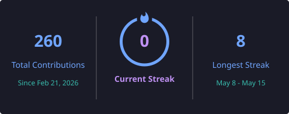

<div align="center">

# Hey, I'm Rishi 👋

### Software Developer • Systems • Backend • Full Stack

I like building things from the ground up — from low-level networking and Linux systems to distributed backends and full-stack applications.

<br>

<a href="https://github.com/RishiRamani">
  
</a>
<a href="https://linkedin.com/in/rishiramani">
  
</a>
<a href="mailto:rishiramani1512@gmail.com">
  
</a>

</div>

---

## 👨‍💻 About Me

- 🎓 B.Tech Computer Science Engineering @ **USICT, GGSIPU**
- 🛠️ **Web Team Lead** @ ACM USICT Student Chapter
- ⚙️ Interested in **backend engineering, distributed systems & systems programming**
- 🐧 Comfortable working with **Linux, C, networking and low-level systems**
- 🌐 Also build full-stack applications with **React, Node.js & TypeScript**
- 🧠 Currently exploring deeper concepts in **distributed systems and backend architecture**

I enjoy understanding what's happening underneath the abstractions rather than just using them.

---

## 🧰 Tech Stack

### Languages

<p>
  
</p>

### Backend & Databases

<p>
  
</p>

### Frontend

<p>
  
</p>

### Systems & Networking

`POSIX Sockets` • `pthreads` • `HTTP/1.1` • `TCP/IP` • `Linux System Programming`

### Tools

<p>
  
</p>

---

# 🚀 Featured Projects

<table>
<tr>
<td width="50%">

### ⚙️ Distributed Job Platform

**Go • Redis • Lua**

A distributed background-job system built from scratch.

- Multiple independent workers
- Shared Redis-backed job queue
- Renewable worker leases
- Atomic state transitions using Lua
- Automatic abandoned-job recovery
- Up to 3 automatic retries
- Graceful worker shutdown

<a href="https://github.com/RishiRamani/distributed-job-platform">
View Repository →
</a>

</td>

<td width="50%">

### 🌐 Multi-threaded HTTP Server

**C • POSIX Sockets • pthreads**

An HTTP/1.1 server built without external frameworks.

- Concurrent client handling
- Manual HTTP request parsing
- Persistent keep-alive connections
- Thread-safe CRUD API
- Mutex-protected storage
- Structured JSON responses

<a href="https://github.com/RishiRamani/c_http_server">
View Repository →
</a>

</td>
</tr>

<tr>
<td width="50%">

### 🐚 Unix Shell

**C • Linux System Programming**

A custom Unix-like shell implementing core shell functionality.

- `fork()` / `execvp()`
- Multi-stage pipelines
- I/O redirection
- Background processes
- Signal handling
- Pipes & file descriptors

<a href="https://github.com/RishiRamani/unixshell">
View Repository →
</a>

</td>

<td width="50%">

### 🤖 SeniorOS

**Qwen • Python • Electron • Node.js**

An accessible desktop environment designed to simplify computer interaction.

- Senior-friendly interface
- Large intuitive controls
- Qwen-powered assistant
- Step-by-step task assistance
- Electron desktop environment

🏆 **3rd Place — NextGen Innovation 2026**

</td>
</tr>
</table>

---

# 🏆 Highlights

<div align="center">

| | |
|---|---|
| 🎓 | **B.Tech CSE — CGPA 8.9** |
| 👨‍💻 | **Web Team Lead — ACM USICT** |
| 🏆 | **3rd Place — NextGen Innovation 2026** |
| 🧩 | **Distributed Systems + Systems Programming** |
| 🌐 | **Full-Stack Development** |

</div>

---

# 👨‍💻 ACM USICT

### Web Team Lead

As Web Team Lead at the **GGSIPU USICT ACM Student Chapter**, I work across the complete development lifecycle:

```text
Requirements
     ↓
Architecture
     ↓
Development
     ↓
Code Review
     ↓
Testing
     ↓
Deployment
     ↓
Monitoring
     ↓
Live Event Operations
```

I've worked on web platforms supporting technical events and student activities, including **DecoDisaster**, an event platform with real-time leaderboards, automated scoring and participant management.

---

# 📊 GitHub Stats

<div align="center">



<br><br>



<br><br>



</div>

---

# 📈 Contribution Activity

<div align="center">


</div>

---

# 🧠 What I'm Into

```text
Systems Programming
       │
       ├── C / Linux
       ├── Processes & Threads
       ├── Networking
       └── HTTP / TCP/IP
              │
              ▼
       Backend Engineering
              │
              ├── Go
              ├── Redis
              ├── Distributed Systems
              └── Concurrency
              │
              ▼
       Full-Stack Development
              │
              ├── React
              ├── Node.js
              ├── TypeScript
              └── Databases
```

---

# 🔭 Currently Building

### ⚡ Going deeper into backend & distributed systems

I'm particularly interested in understanding:

- Distributed workers
- Concurrency & synchronization
- Queues and job processing
- Fault tolerance
- Networking
- Backend architecture
- Systems programming

---

# 📫 Let's Connect

<div align="center">

<a href="mailto:rishiramani1512@gmail.com">
  
</a>

<a href="https://linkedin.com/in/rishiramani">
  
</a>

<a href="https://github.com/RishiRamani">
  
</a>

<br><br>


</div>

---

<div align="center">

### "Always trying to go one layer deeper."

</div>
